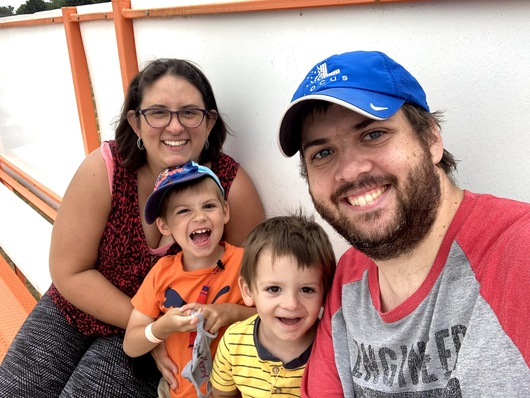

# The Site

Today's Pointless Click is a collection of nonsense. Some of it might have some sort of educational or entertainment value, but it's all meant to scratch my own development itch. It's for fun! Can't we just have fun once in a while?

# The Author

I have been working as a software engineer in the industrial/warehouse mobile robotics industry since 2013. I've independently designed and developed real-time monitoring software that currently manages a fleet of *over ten thousand robots operating worldwide.*

Today I lead a team of software engineers in developing mobile robot mapping, fleet configuration, and monitoring applications for Web, dashboard, and mobile uses in large warehouse spaces.

Most of my time is enjoyed being a dad of two boys, which usually means getting into lots of mischief. When I'm not doing any of that, I'm likely on the piano, working on home rennovations, or writing software for fun. I completed both a BES and MSc in Geography at the University of Waterloo.

## Development Philosophy

I thrive in situations where I need to wear many hats, which is why I've thrived working at start-ups.

For example, I was hired for a specific mission: *"we need to configure and monitor robot deployments without regular involvement from engineers."*  This was accomplished by interviewing the deployment and customer success staff to understand the workflows, challenges, and opportunities. With the insight gathered, I prototyped an application, wrote the front-end, back-end, database schema, validation, backup strategy, cloud deployment, CI/CD, user manuals, and service monitoring tooling.

This process was not monolithic. The best way to build the right tool with start-up levels of resourcing is to ship it early and often to learn what works, what doesn't, and what you don't yet know about a problem. A prototype was available within a few weeks and has seen hundreds of improvements over the years.

Once our product and company matured, and our customer base grew by multiple orders of magnitude, I shared many of those hats with a team that I hired and manage today.

## Tech Overview

Sometimes it helps to build a mental model of someone by looking at the tools they use:

* TypeScript, Python, Rust, C#
* React, Django, AWS/CDK, PostgreSQL
* [ROS](https://ros.org/) - the Robot Operating System
* QGIS, ArcGIS, ENVI, ERDAS, Geomatica

# Links

E-Mail: [ablakey@gmail.com](mailto:ablakey@gmail.com)

GitHub: [Andrew Blakey](https://github.com/ablakey)

Blog Template: [Typo by Francesco Tomaselli](https://github.com/tomfran/typo)
