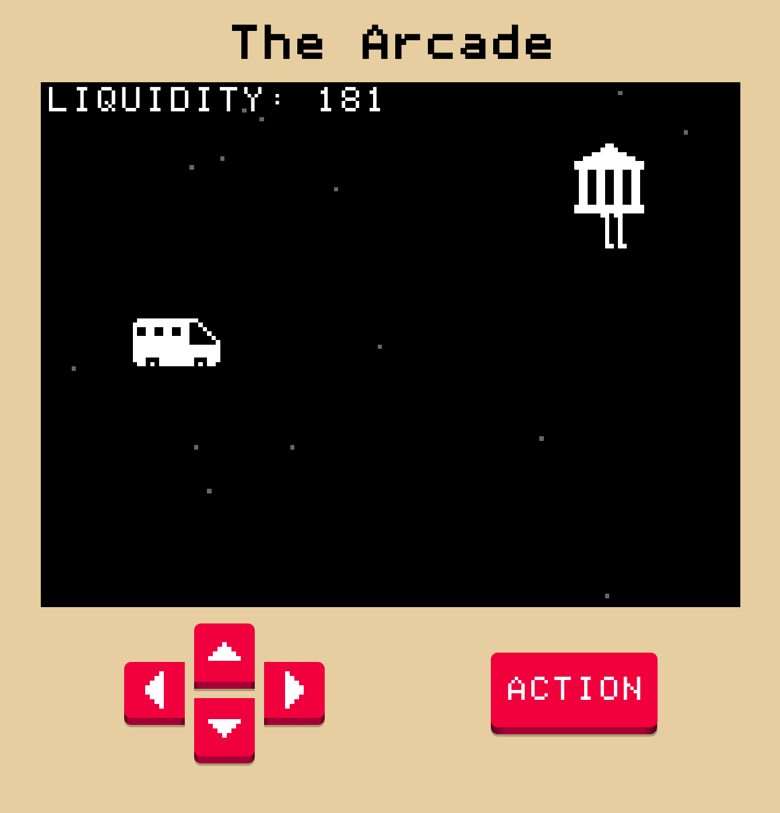

---
title: "The Arcade"
date: 2023-01-03
---I wrote a small game engine for simple arcade games as a way to get around the "I'm bad at art." You can't be bad at art when you only have an Atari worth of pixels to work with.

Currently there's two games:

- _Spy Balloon!_: Shoot down the secret spy balloons!
- _Bank Run!_: There's a run on the bank. Can you stop it?

[Play it Here](https://arcade.pointless.click/)

