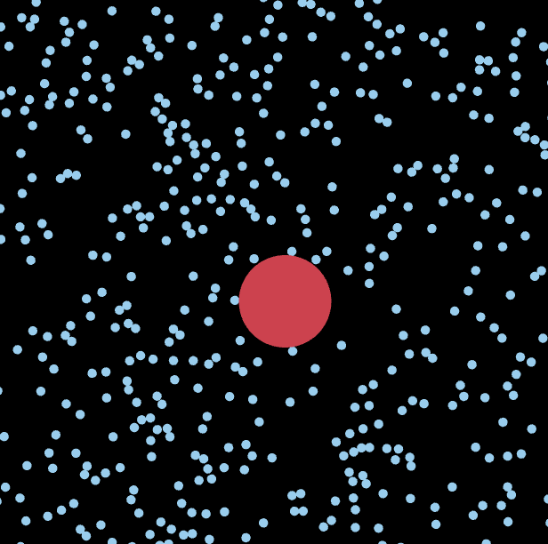

I wanted to see if I could reproduce a small simulator that demonstrates Brownian Motion.  It works well, but I cannot get the simulation to be completely leak-free. The bodies eventually slow down.

[Check it out here](https://physics.pointless.click)

[Source code](https://github.com/ablakey/physics)

