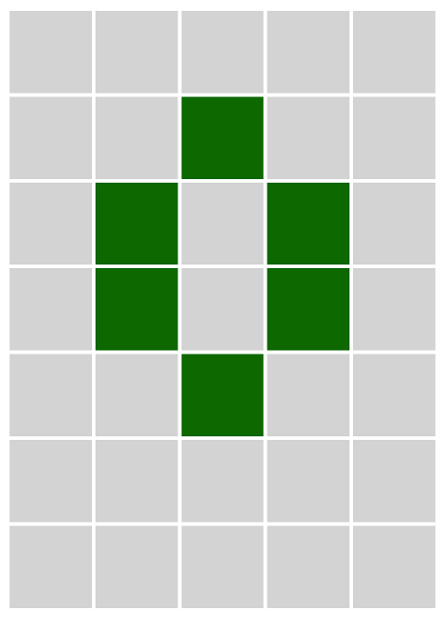

Whenever you toggle a light, it also toggles its neighbours. This is a game I remember from my childhood. Similar to a puzzle found in System's Twilight for the Macintosh.

[Play it Here](https://ablakey.github.io/lights-out/index.html)

